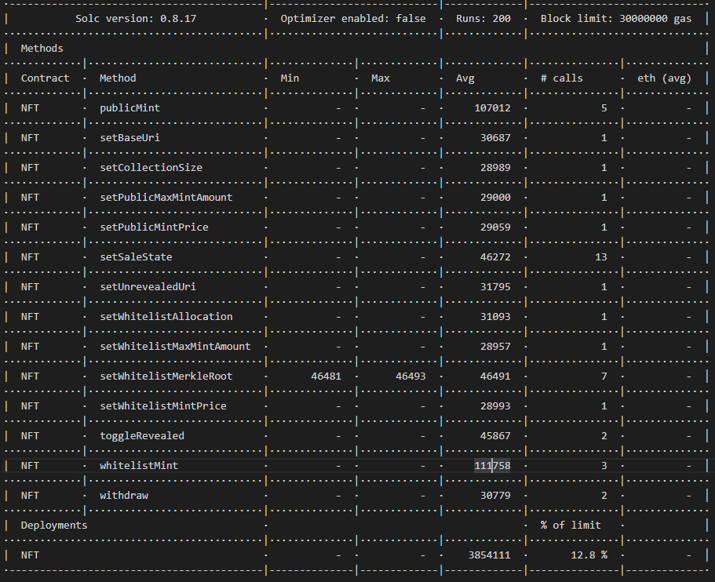
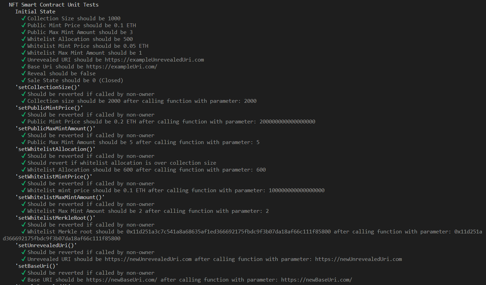
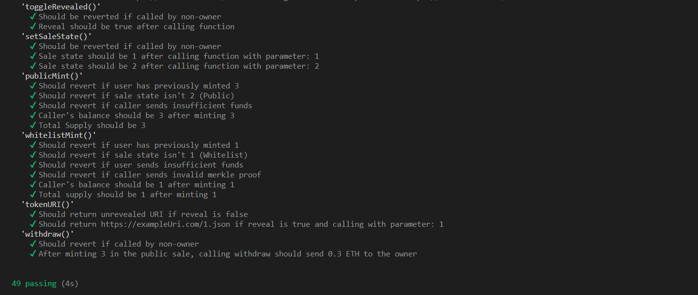
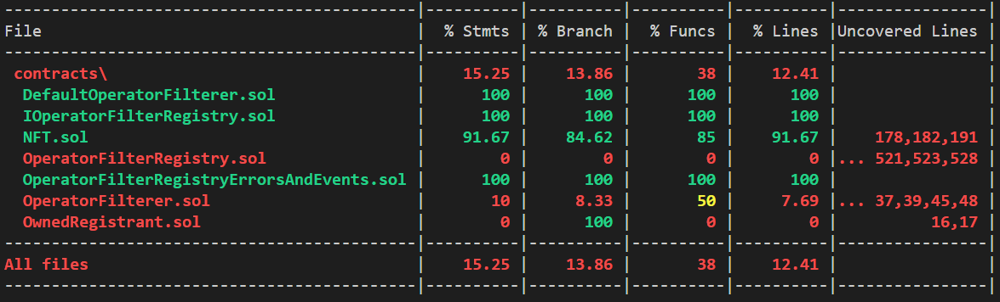

# ERC721A Smart Contract

This repository contains a hardhat development environment that revolves around an NFT minting smart contract. With the contract, users are able to mint ERC721A standard NFTs.

## About the Contract

The minting contract follows the ERC721A token standard, which is appraised in the web3 industry as a low gas-cost standard to mint NFTs. Industry standard features were also implemented into the contract, such as whitelisted addresses and mints, reveals & NFT metadata.

## Optimizing Gas Costs

The contract was built in consideration to minimizing and optimizing gas costs. Like the ERC721A token standard, Merkle Trees are also an industry standard for optimizing gas costs within NFT minting contracts. This was implemented to securely verify whitelisted addresses during whitelist mints.

Other small strategies were used to optimize for gas costs, such as the implementation of custom errors and use of revert statements.

A gas report for the contract can be seen below:

## Testing & Coverage

Extensive unit testing was performed for the contract, in which every function was tested to ensure it's functionality and useability. Tests results can be seen below:

Additionally, solidity coverage was run to ensure that every function within the contract was tested. The results below indicate that only 91.67% of the contract was tested. This is because the functions inherited from the 'Default Operator Filterer' protocol were not tested.

;

## Technologies Used

- Solidity
- Hardhat
- Keccak256 & Merkle Trees
- Solidity Coverage
- Hardhat Gas Reporter
- ERC721A and Open Zeppelin Contracts